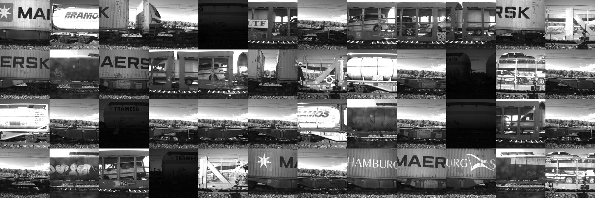

# Railway Wagon Stitching Benchmark

Evaluation framework and benchmark protocol for the paper:

> **Robust Image Stitching for Railway Wagon Inspection in Uncontrolled Outdoor Environments**
> Alejandro Diaz-Diaz, Francisco Parrilla, Luis M. Bergasa.
> *Sensors* (MDPI), 2026.

This repository contains the **evaluation scripts**, the **input/output format
specification**, and a **runnable example**. The full benchmark dataset (frame
sequences and the complete ground-truth annotations) is available **on request**;
see [Benchmark dataset](#benchmark-dataset).

---

## What this evaluates

Sequential stitching of a moving railway wagon seen by a **fixed trackside
camera**: consecutive frames overlap horizontally, and the stitching system must
estimate the inter-frame displacement of the wagon.

The system under test is treated as a **black box**: you feed it a sequence of
frames, it emits a `frame_offsets.json`, and the evaluator scores that file.

Three tiers are computed, then combined into a weighted geometric mean:

| Tier | Name | Measures | Needs ground truth |
|---|---|---|---|
| T1 | Degenerate Rate | pairs collapsed to zero displacement while the train was moving | no |
| T2 | Displacement Accuracy | per-pair displacement error against manual annotations | **yes** |
| T3 | Sequence Stability | consistency of the displacement signal along the sequence | no |

```
Composite = T1^0.1 · T2^0.6 · T3^0.3
```

Full definitions, thresholds and rationale: [`evaluation/README.md`](evaluation/README.md).

---

## Repository contents

```
railway-stitching-benchmark/
├── README.md                    ← this file
├── LICENSE                      ← MIT
├── CITATION.cff
├── evaluation/                  ← the evaluation framework (pure Python stdlib)
│   ├── README.md                ← tier definitions and scoring methodology
│   ├── evaluate.py              ← CLI: evaluate one sequence
│   ├── evaluate_dataset.py      ← CLI: batch evaluation over a full dataset
│   ├── tier1_dr.py              ← T1 Degenerate Rate
│   ├── tier2_da.py              ← T2 Displacement Accuracy
│   ├── tier3_ss.py              ← T3 Sequence Stability
│   ├── score.py                 ← composite score and report formatting
│   └── offsets.py               ← frame_offsets.json parsing
├── examples/                    ← one complete, runnable example sequence
│   ├── README.md
│   ├── frame_offsets.json       ← reference-system output for the example wagon
│   └── annotations/             ← the 9 ground-truth pairs of that wagon
└── figures/                     ← illustrations used by this README
```

**Requirements:** Python ≥ 3.9. The evaluation scripts use only the standard
library.

---

## Quick start

Clone the repository and run the evaluator on the bundled example:

```bash
cd evaluation
python evaluate.py \
    --offsets     ../examples/frame_offsets.json \
    --annotations ../examples/annotations
```

Expected output:

```
============================================================
RAILWAY WAGON STITCHING BENCHMARK — EVALUATION REPORT
============================================================
System  : Reference pipeline (dense matcher + filter cascade + recovery)
Sequence: wagon_10

TIER SCORES
------------------------------------------------------------
T1  Degenerate Rate         : 1.0000
    DR=0.000  (0/14 pairs degenerate)
T2  Displacement Accuracy    : 1.0000
    9 GT pairs  mean_error=19.3 px
T3  Sequence Stability       : 0.9900
    CoV_dx=0.005  dx_std=4.2 px

------------------------------------------------------------
Composite score [T1, T2, T3]  : 0.9970
============================================================
```

To evaluate **your own** system, replace `--offsets` with the file it produces
(see below) and keep the same annotations directory. Add `--output report.json`
to save the full per-pair breakdown.

T2 is the only tier that needs ground truth. Without `--annotations` the
evaluator still runs and renormalises the composite over T1 and T3:

```bash
python evaluate.py --offsets ../examples/frame_offsets.json
```

Each tier module also runs standalone:

```bash
python tier1_dr.py --offsets ../examples/frame_offsets.json
python tier2_da.py --offsets ../examples/frame_offsets.json --annotations-dir ../examples/annotations
python tier3_ss.py --offsets ../examples/frame_offsets.json
```

The thresholds of every tier and the composite weights can be overridden from
the command line, which is what the sensitivity analysis in the paper sweeps:

```bash
python evaluate.py --offsets ../examples/frame_offsets.json \
    --annotations ../examples/annotations \
    --weights 0.1,0.8,0.3 --tolerance 0.02 --penalty 0.10 --max-cov 0.25
```

`--weights` takes the exponents of T1, T2 and T3. They are renormalised over the
tiers actually available, so only their ratios matter.

### Batch evaluation

Once you have the full dataset, `evaluate_dataset.py` scores every wagon at once
and writes `eval_summary.csv` / `eval_summary.json`:

```bash
python evaluate_dataset.py \
    --results-dir  /path/to/your/runs \
    --labels-dir   /path/to/dataset/labels \
    --output-dir   /path/to/your/evaluation_output
```

Both trees are expected to be organised as `{train_id}/{wagon_id}/`, with
`frame_offsets.json` under `--results-dir` and `gt_pair_*.json` under
`--labels-dir`.

---

## What your system must output

One `frame_offsets.json` per wagon sequence:

```json
{
  "system":     "MyStitcher v1.0",
  "wagon":      "wagon_10",
  "train":      "train_01",
  "frames":     ["frame_000.jpg", "frame_001.jpg", "..."],
  "offsets_px": [0, 835, 1669, "..."]
}
```

| Field | Required | Description |
|---|---|---|
| `offsets_px` | **yes** | Cumulative horizontal canvas position of each frame, in pixels. The first frame is always 0. Sign follows the direction of travel; the evaluator compares magnitudes. |
| `frames` | no | Ordered frame filenames, for reporting |
| `wagon` | no | Sequence identifier, for reporting and batch matching |
| `train` | no | Train identifier, for reporting and batch matching |
| `system` | no | Name/version of the system under test, for reporting |

Most pipelines estimate a per-pair displacement `dx_i` (shift of frame `i+1`
relative to frame `i`). The offsets are its cumulative sum:

```python
offsets_px = [0]
for dx in per_pair_displacements:
    offsets_px.append(offsets_px[-1] + dx)
```

Pair *i* is identified as `"{i:02d}_{i+1:02d}"` (`"00_01"`, `"01_02"`, …), which
is how ground-truth files are matched to your offsets.

---

## Benchmark dataset

**30 wagon sequences from 6 trains — 403 frames, 262 annotated pairs.** Frames
are 2048 × 4096 px; annotation coordinates refer to that resolution.



| Surface category | Illumination | Sequences | Annotated pairs |
|---|---|---|---|
| Closed container wagons | day | 5 | 49 |
| Open empty wagons | day | 5 | 50 |
| Cistern wagons | day | 10 | 77 |
| Cistern wagons | night, no flash | 5 | 36 |
| Flatcars carrying road vehicles | day | 5 | 50 |

Layout of the released dataset, which mirrors what the batch evaluator expects:

```
images/train_01/wagon_10/frame_000.jpg
annotations/train_01/wagon_10/gt_pair_00_01.json
DATASET.txt                                   ← full per-sequence breakdown
```

Annotation format (one `gt_pair_XX_YY.json` per pair — see
[`examples/annotations/`](examples/annotations/) for nine real files):

```json
{
  "pair_id": "00_01",
  "train_id": "train_01",
  "wagon_id": "wagon_10",
  "frame_left":  "frame_000.jpg",
  "frame_right": "frame_001.jpg",
  "image_width": 2048,
  "image_height": 4096,
  "matches":      [{"id": 1, "left": {"x": 1557, "y": 2408}, "right": {"x": 660, "y": 2376}}, "..."],
  "derived_dx":   ["..."],
  "derived_dy":   ["..."],
  "gt_dx_median": -815,
  "gt_dx_mean":   -827.9,
  "annotated_date": "2026-04-23"
}
```

The evaluator reads only `pair_id` and `gt_dx_median`; the individual
correspondences are kept so that other metrics can be derived from the same
annotations.

`gt_dx_median` is the **upper median** of the ten per-point displacements: with
an even number of correspondences it is the higher of the two central values,
not their average. This is the value used throughout the paper. The difference
from the arithmetic median is 1.5 px at the median pair and 2.8 px on average
(0.34% of the displacement), well inside the 5% inner tolerance of T2, so the
two conventions give the same tier scores; `derived_dx` is provided if you
prefer to recompute it another way.

### Requesting the dataset

The frame sequences are operational imagery captured under a data-sharing
agreement and are **not publicly redistributable**. The complete dataset (frames
and the 262 ground-truth annotations) is available **on reasonable request for
research use**.

Write to the corresponding author, **adiazd@indra.es**, with:

- your name, affiliation and a contact address at your institution;
- a brief description of the intended use;
- confirmation that the data will be used for research purposes only and will
  not be redistributed.

This repository ships one wagon's annotations so that the framework can be
inspected and run before requesting anything: the frames are not needed to
evaluate.

---

## License

[MIT](LICENSE) for the code and the example annotations in this repository. The
benchmark imagery is not covered by this license and is distributed only under
the request procedure described above.

---

## Citation

```bibtex
@article{diazdiaz2026stitching,
  title     = {Robust Image Stitching for Railway Wagon Inspection in
               Uncontrolled Outdoor Environments},
  author    = {Diaz-Diaz, Alejandro and Parrilla, Francisco and
               Bergasa, Luis M.},
  journal   = {Sensors},
  publisher = {MDPI},
  year      = {2026},
  note      = {Volume, article number and DOI to be added upon publication}
}
```
